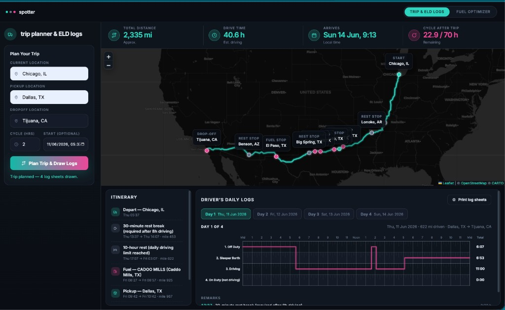
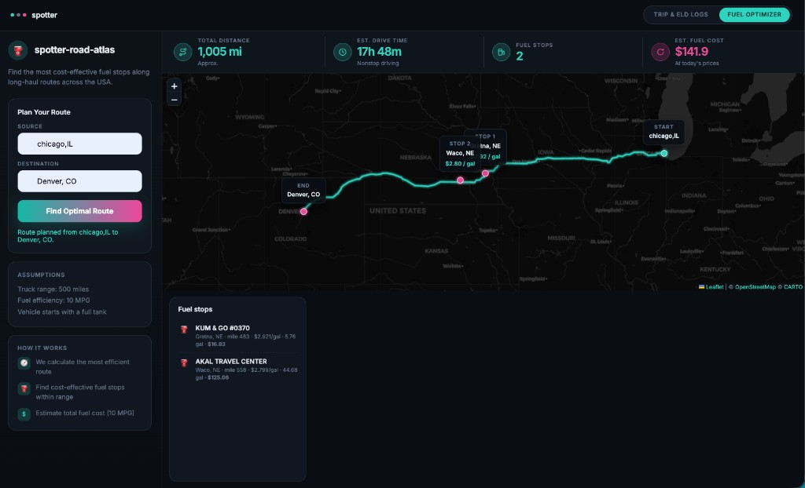
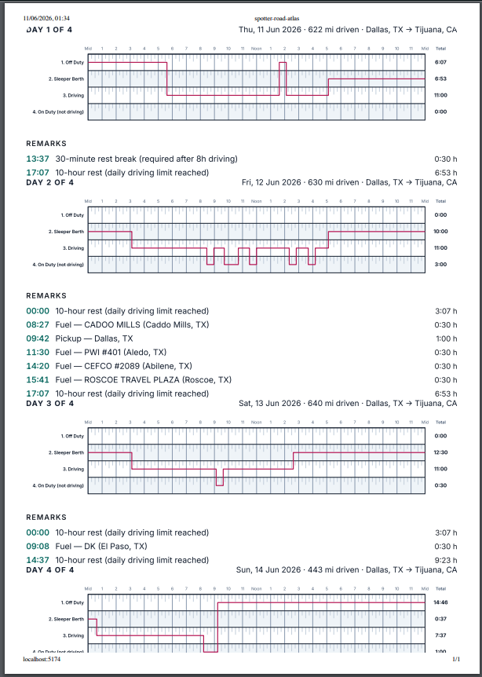

# spotter-road-atlas

*Every mile has a price. We find the cheap ones.*

Imagine a seasoned long-haul driver who's spent 30 years trucking America. They know every cheap fuel stop between Chicago and Dallas, they can feel when the tank's getting low before the gauge moves, and they never waste a mile backtracking for gas. This project is about bottling that hard-won road wisdom into an API — and giving dispatchers a dashboard to plan routes, draw HOS-compliant logs, and scout cheap fuel along the way.

Built for a rig that starts full, burns **10 MPG**, and can't gamble on anything farther than **500 miles** from the pump.

---

## The UI

One React app, two tabs. Django is a pure API; the SPA is the only UI.

### Trip planner & ELD logs

Plan a multi-stop haul, see every required rest and fuel stop on the map, and get printable driver's daily log sheets — one per calendar day.



**Example trip:** Chicago → Dallas (pickup) → Tijuana (drop-off), 2 hrs already on the 70/8 cycle. The app returns the route, itinerary, and four daily logs for a 4-day run.

### Fuel optimizer

Find the cheapest fuel stops along a long-haul corridor between any two US points.



**Example route:** Chicago → Denver. Two stops (Gretna, NE and Waco, NE) chosen by the price optimizer; total estimated fuel cost at today's OPIS prices.

### Printed log sheets

Click **Print log sheets** in the trip planner to get paper-style grids — 15-minute ticks, a continuous duty-status line, remarks, and per-status totals. All days print in one go.



---

## Wake the atlas

```bash
# API (terminal 1)
python3 -m venv .venv && source .venv/bin/activate
pip install -r requirements.txt
python manage.py migrate
python manage.py import_stations   # one-time: loads the OPIS ledger, geocodes offline (~3s)
python manage.py runserver

# UI (terminal 2)
cd frontend && npm install && npm run dev   # http://localhost:5173
```

**Fuel route API:**

```
GET /api/v1/fuel-route?start=Chicago, IL&finish=Denver, CO
```

City names, state abbreviations, or raw coordinates (`41.8781,-87.6298`) all work. POST a JSON body if you prefer.

---

## What comes back (fuel route)

```json
{
  "route": {"distance_miles": 1005.2, "duration_hours": 17.8},
  "fuel_plan": {
    "stops": [{"name": "KUM & GO #0370", "city": "Gretna", "state": "NE", "cost": 16.83}],
    "total_fuel_cost": 141.90
  },
  "map": {"type": "FeatureCollection", "features": ["route", "start", "finish", "fuel_stop"]}
}
```

If the road outruns the station ledger — a 500-mile dead zone with no known pump — you get **422** with the route drawn anyway, so you can see how far you got before the math gave up.

---

## What we call in from outside

| Call | Who | How often |
|---|---|---|
| Route geometry | OSRM | exactly 1 per request |
| Start / finish lookup | Nominatim | 0-2 (cached; skip with coordinates) |

Stations never hit the network. They're resolved at import from city centroids, good enough for highway corridor work, fast enough to never slow a request down.

---

## The logbook — trip planner & ELD daily logs

The second job: give the atlas a working day, not just a route. Truckers call the old paper grid the *comic book* — four rows, 24 hours, a line that tells the whole story of a driving day. This feature draws that comic book for you, by the rules.

**Inputs:** current location, pickup location, dropoff location, current cycle used (hrs).
**Outputs:** the route with every required stop on the map, and filled-out driver's daily log sheets — one per calendar day.

```
POST /api/v1/trip-plan
{
  "current_location": "Chicago, IL",
  "pickup_location": "Dallas, TX",
  "dropoff_location": "Tijuana, CA",
  "current_cycle_used_hours": 2,
  "start_time": "2026-06-11T05:37:00"   // optional, defaults to 08:00 today
}
```

The scheduler enforces FMCSA property-carrying limits (70hr/8day, no adverse conditions):

| Rule | How it shows up |
|---|---|
| 11h driving / shift | driving line breaks, 10-hr rest inserted |
| 14h on-duty window | window caps driving; on-duty work may finish past it |
| 30-min break after 8h driving | break inserted; a ≥30-min on-duty stop (fuel, pickup) also resets the clock (post-2020 rule) |
| 70hr/8day cycle | budget model from `current_cycle_used_hours`; 34-hr restart when exhausted |
| Fueling every ≤1,000 mi | real stations picked by the price optimizer |
| Pickup / drop-off | 1 hour each, on duty |

Response carries `daily_logs` — per-day duty segments (`off_duty` / `sleeper_berth` / `driving` / `on_duty`) with start/end hours, per-status totals and miles driven — plus `stops`, trip stats and a map FeatureCollection. The React app draws each day as the classic grid: 15-minute ticks, a continuous status line, remarks, totals column. Print-ready.

### Deploy

The SPA builds static (`npm run build`) and ships to Vercel with `VITE_API_URL` pointing at the hosted Django API (CORS is preconfigured). Requires Node 18+.

### Architecture note

`trips/` is a second bounded context with the same layering (pure `domain/` — `hos_scheduler.py`, `log_sheets.py` — then `application/`, `infrastructure/`, `api/`). It reuses the `routes/` context's geocoder, station repository, fuel optimizer and geometry as a shared kernel. One OSRM call covers all three waypoints.

**Assumptions:** vehicle starts fueled; the 70/8 cycle is a budget (rolling 8-day recovery beyond the 34-hr restart isn't simulated); times use the home-terminal clock (naive local); fuel stops take 30 minutes.

---

## Prove it

```bash
python manage.py test tests
```

34 tests. Domain logic runs pure Python; only OSRM and Nominatim get stubbed in the API layer.

---

*spotter · three dots on the horizon · teal, grey, pink*
