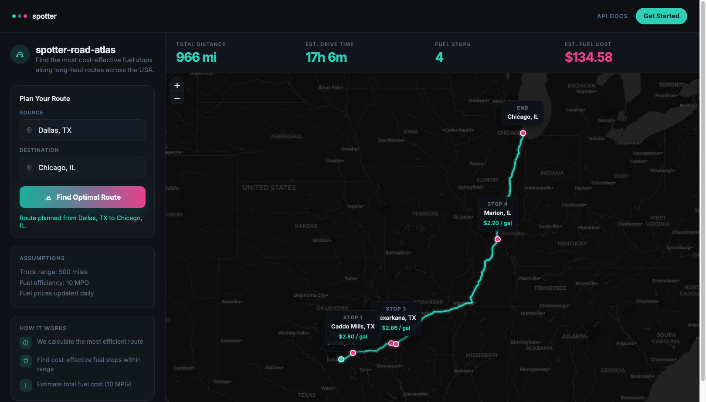

# spotter-road-atlas

*Every mile has a price. We find the cheap ones.*

Imagine a seasoned long-haul driver who's spent 30 years trucking America. They know every cheap fuel stop between Chicago and Dallas, they can feel when the tank's getting low before the gauge moves, and they never waste a mile backtracking for gas. This project is about bottling that hard-won road wisdom into an API.

Long-haul freight doesn't care about the scenic route; it cares about **gallons per dollar**. **spotter-road-atlas** is Spotter's dispatch desk for the open road: give it two points on the map, and it returns the driving line, the fuel stops worth pulling over for, and the total you'll pay to get there.

Built for a rig that starts full, burns **10 MPG**, and can't gamble on anything farther than **500 miles** from the pump.



---

## The job

You're hauling from **Dallas** to **Chicago**. The road is ~966 miles. Diesel prices jump every county. Your tank holds 500 miles of range, no more, no less.

The atlas does three things:

1. **Draws the road**: one call to OSRM, no API keys, no guesswork.
2. **Scouts the corridor**: ~6,600 US truck stops, geocoded once at import, matched to the route in milliseconds.
3. **Buys smart**: at each stop, fill only what you need to reach the next cheaper station. Classic gas-station greedy. Provably minimum spend for the stops you're given.

The answer comes back as JSON: route stats, stop list, total cost, and a **GeoJSON map** you can paste straight into [geojson.io](https://geojson.io) and watch the line light up.

---

## Wake the atlas

```bash
python3 -m venv .venv && source .venv/bin/activate
pip install -r requirements.txt
python manage.py migrate
python manage.py import_stations   # one-time: loads the OPIS ledger, geocodes offline (~3s)
python manage.py runserver
```

**Web UI:** http://127.0.0.1:8000/

**API:**

```
GET /api/v1/fuel-route?start=Dallas, TX&finish=Chicago, IL
```

City names, state abbreviations, or raw coordinates (`32.7767,-96.7970`) all work. POST a JSON body if you prefer.

---

## What comes back

```json
{
  "route": {"distance_miles": 966.4, "duration_hours": 17.1},
  "fuel_plan": {
    "stops": [{"name": "HUCKS FOOD & FUEL #379", "city": "Marion", "state": "IL", "cost": 84.93}],
    "total_fuel_cost": 134.68
  },
  "map": {"type": "FeatureCollection", "features": ["route", "start", "finish", "fuel_stop"]}
}
```

If the road outruns the station ledger, a 500-mile dead zone with no known pump, you get **422** with the route drawn anyway, so you can see how far you got before the math gave up.

---

## What we call in from outside

| Call | Who | How often |
|---|---|---|
| Route geometry | OSRM | exactly 1 per request |
| Start / finish lookup | Nominatim | 0-2 (cached; skip with coordinates) |

Stations never hit the network. They're resolved at import from city centroids, good enough for highway corridor work, fast enough to never slow a request down.

---

## Prove it

```bash
python manage.py test tests
```

21 tests. Domain logic runs pure Python; only OSRM and Nominatim get stubbed in the API layer.

---

*spotter · three dots on the horizon · teal, grey, pink*
